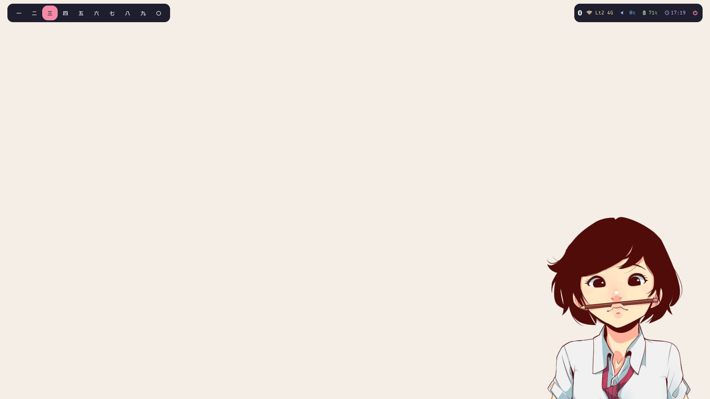

<div align='center'>
    <br><br><br>

```
侘 | 寂
```

</div>

# Installation

## Initial setup
1. Install sway
   ```
   sudo apt install sway waybar -y
   ```
2. Install dependencies
   ```
   sudo apt install kitty rofi thunar xterm light grimshot -y 
   ```
3. Install optional dependencies
   ```
   sudo apt install cava neofetch lxappearance -y
   ```

## Install hotfiles
1. Copy all folders to your $HOME directory
   ```
   cp -r {.bin,.config,.icons,.theme} ~/
   ```
2. Install fonts
   ```
   git clone https://github.com/ryanoasis/nerd-fonts
   ```
   ```
   cd nerd-fonts
   ```
   ```
   ./install.sh
   ```
3. Install wallpapers
   ```
   git clone https://github.com/catppuccin/wallpapers
   ```
   ```
   mv wallpapers ~/Pictures/
   ```
4. If you logged in another DE/WM, logout first
5. Login to SwayWM from display manager or from tty by typing :
   ```
   sway
   ```

# Owner's section
## Todo :
- [ ] Control center
  - [x] Power menu
  - [x] Bluetooth manager
  - [x] Network manager
  - [ ] Power management
  - [ ] Media control
- [ ] Calendar
- [ ] Notification
  - [ ] Auto switch between spotify and notification
- [ ] Theme switcher

## Notes :
- I can't use notification daemon, tell me if you can use something like dunst or mako
- You can't forget wifi profile from Network Manager, so you have to manually forget it using nmcli/nmtui or you can use nm-tray as well